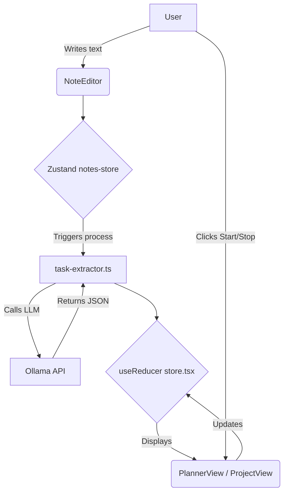
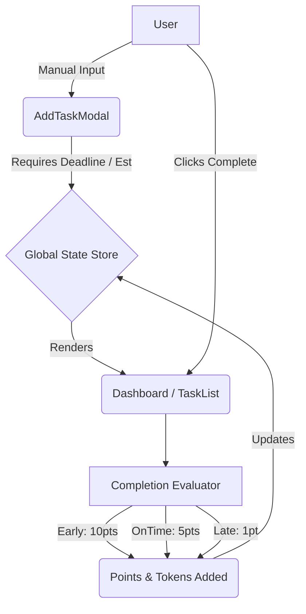
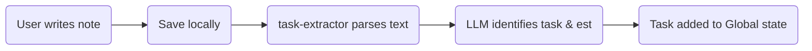
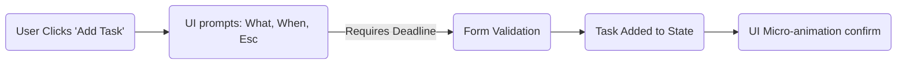

# action-plan-refac.md

## 0. Table of Contents
1. [Project Overview](#1-project-overview)
2. [Current System (AS-IS)](#2-current-system-as-is)
3. [New Target System (TO-BE)](#3-new-target-system-to-be)
4. [Comparative Analysis](#4-comparative-analysis)
5. [Current File Structure](#5-current-file-structure)
6. [Proposed File Structure](#6-proposed-file-structure)
7. [Old vs New Flowcharts](#7-old-vs-new-flowcharts)
8. [Feature-by-Feature Refactor Plan](#8-feature-by-feature-refactor-plan)
9. [Page / Screen Mapping](#9-page--screen-mapping)
10. [Component Refactor Plan](#10-component-refactor-plan)
11. [Data Model / Domain Refactor](#11-data-model--domain-refactor)
12. [API / Backend Refactor Plan](#12-api--backend-refactor-plan)
13. [State Management Refactor Plan](#13-state-management-refactor-plan)
14. [Migration Strategy](#14-migration-strategy)
15. [Actionable Task List](#15-actionable-task-list)
16. [Risks, Conflicts, and Open Questions](#16-risks-conflicts-and-open-questions)
17. [Traceability Map](#17-traceability-map)
18. [Final Refactor Summary](#18-final-refactor-summary)

---

## 1. Project Overview

**Current Product:** PixelNotes, a local-first application that handles notes, auto-extracts tasks from unstructured text via an LLM (Ollama), and allows users to track active time spent completing those tasks. It includes projects dynamically categorized based on notes.

**New Product:** PixelTodo MVP, a lightweight, gamified to-do system designed to encourage users to set realistic deadlines and complete tasks on time. Instead of an AI-driven note-to-task pipeline, it relies on manual task creation with a focus on upfront estimation. It employs an underlying economy (Points, Tokens, Productivity Score).

**Why the refactor is happening:** The focus is shifting away from AI-driven automation (which may fail, distract, or overwhelm) toward behavioral reinforcement (gamification, points, and deadline planning). AI will be hidden as a "Coming soon!" feature.

**What success looks like:** A functional MVP where users can create tasks with required deadlines, complete them, and be graded/rewarded instantly by a robust point system that drives behavioral change without excessive cognitive load.

**Core Codebase Strategy:** Instead of deleting our current AI note-taking codebase and losing progress, we will push the current state to a `pixelnotes-legacy` branch. Once safeguarded, we will build the new PixelTodo MVP directly on the `main` branch, allowing us to safely clear out old features from `main` without fear of deletion.

---

## 2. Current System (AS-IS)

### Current Purpose
To act as a smart notebook that magically organizes your life by lifting tasks out of paragraphs and offering built-in stopwatch-style time tracking.

### Current Flows
- User creates and edits a `Note`.
- System triggers a local LLM processing step via `task-extractor.ts`.
- Extracted tasks populate the `Planner` and `Project` views.
- User tracks time against tasks (`START_TRACKING`, `STOP_TRACKING` via `store.tsx`).

### Current Architecture
- Frontend: Next.js 14/15 React App (`AppRouter`).
- State Management: Split between native `useReducer` + LocalStorage (`store.tsx` for tasks) and Zustand + LocalStorage (`notes-store.ts`, `projects-store.ts` for entities).
- AI layer: Direct HTTP requests to local Ollama endpoints.

### Current Limitations
- AI extraction can be slow, unpredictable, or contextually incorrect.
- No emphasis on completion deadlines or task completion behavior/gamification.



---

## 3. New Target System (TO-BE)

### Target Product Summary
PixelTodo MVP strips out note-taking entirely for v1. It introduces a heavily opinionated manual task creation loop demanding deadline estimation. Timely completion grants tokens and productivity score improvements; tardiness penalizes. 

### Core Goals
- Reward realistic planning over blind automation.
- Drive a simple, engaging task-creation experience.
- Maintain a retro-pixel, terminal-like aesthetic.

### Expected Architecture
Minimal client-side execution. A unified state system governing User Stats (Tokens, Points, Score) and Tasks. AI logic completely disabled and isolated.



---

## 4. Comparative Analysis

| Area | Current (PixelNotes) | New (PixelTodo MVP) | Gap | Refactor Impact |
|------|----------------------|---------------------|-----|-----------------|
| **Product Scope** | Notes + Tasks + Projects | Tasks + Gamification Stats | Isolating notes/projects to legacy branch; adding gamification rules to `main`. | HIGH (Dropping major domains from main) |
| **User Flows** | Write Note -> Extract Task -> Track Time | Set Task + Deadline -> Wait -> Complete Task -> Earn Points | Moving from reactive tracking to proactive planning. | HIGH (Redesigning task loop) |
| **Data Model** | `Note`, `Project`, `Task` (with Sessions) | `Task` (with Deadline, Points), `UserStats`, `Powerup` | Sessions removed on main. Tags added. | MEDIUM |
| **Components** | `NotesGrid`, `ProjectView`, `NoteEditor` | `PowerupShop`, `StatsDashboard`, redesigned Modal | Older UI cleared from `main`, rebuilt as tasks context. | HIGH |
| **State Mgt** | Mix of Zustand and React Context | Unified store strongly required. | Need a single source of truth for Stats + Tasks. | MEDIUM |
| **Integration** | Local Ollama LLM | None (Disabled) | Logic needs to be hidden behind feature flags or archived. | LOW |
| **Design** | Pixel / CLI Aesthetic | Same Aesthetic | Preserving CSS modules and styling layers. | LOW |

---

## 5. Current File Structure
```text
/src
├── app/
│   ├── layout.tsx
│   ├── page.tsx
│   └── page.module.css
├── components/
│   ├── Dashboard.tsx
│   ├── AddTaskModal.tsx
│   ├── TaskCard.tsx
│   ├── NoteEditor.tsx    [Archived to legacy branch]
│   ├── NotesGrid.tsx     [Archived to legacy branch]
│   ├── ProjectView.tsx   [Archived to legacy branch]
│   ├── PlannerView.tsx   [To Be Refactored on main]
│   └── ASCIIBarChart.tsx
└── lib/
    ├── store.tsx         [Uses Context, missing Stats]
    ├── notes-store.ts    [Archived to legacy branch]
    ├── projects-store.ts [Archived to legacy branch]
    ├── task-extractor.ts [To Be Disabled on main]
    └── ollama.ts         [To Be Disabled on main]
```

---

## 6. Proposed File Structure (Main Branch)
```text
/src
├── app/
│   ├── layout.tsx
│   ├── page.tsx          [Updated to new TabNav system]
├── components/
│   ├── Dashboard.tsx     [Updated with Tokens/Points]
│   ├── TaskList.tsx      [Replaces PlannerView]
│   ├── TaskCard.tsx      [Added gamification badges]
│   ├── AddTaskModal.tsx  [Enforces deadline input]
│   ├── PowerUpShop.tsx   [NEW]
│   ├── ASCIIBarChart.tsx
│   └── common/           [Moved PixelButton, PixelInput here]
└── lib/
    ├── store.ts          [Zustand - Unified Tasks + UserStats]
    ├── evaluator.ts      [NEW - Handles completion rules/math]
    ├── utils.ts
    └── disabled-ai/      [Moved extractor / ollama here]
```
**Why better:** 
Consolidates state to a single Zustand store, avoiding sync traps. Segregates deprecated AI code physically so it doesn't leak into the MVP, while keeping current work securely isolated via Git branches.

---

## 7. Old vs New Flowcharts

### Flow: Task Creation

**Current Flow**


**New Flow (MVP on main)**


---

## 8. Feature-by-Feature Refactor Plan

| Feature | Current | Target (PRD) | Action Needed | Risk Level |
|---------|---------|--------------|---------------|------------|
| **Notes & Projects** | Fully active using Zustand. | Preserved on `pixelnotes-legacy` branch, cleared from `main`. | Branch out current state. Then on `main`, clear legacy components and state. | Low |
| **Task Creation** | Extracted from AI. | Manual, via interactive Modal. | Rebuild `AddTaskModal` to make deadline mandatory. Add hints. | Medium |
| **Time Tracking** | Stopwatch/Sessions per task. | Deprecated on main. | Remove `START_TRACKING` / `sessions` array. | Low |
| **Completion Logic** | Simple boolean toggle. | Deadline-bounded evaluation. | Build logical evaluation: checking `completedAt` vs `deadline`. | High |
| **Rewards & Econ** | None. | Points, Tokens, Score. | Integrate rules. Map completion event payload to increments in `UserStats`. | High |
| **Reminders** | None. | Configurable internal alerts. | Add Reminder configuration metadata to Task schema. | Medium |
| **AI Integration**| Prominently active. | Visually disabled ("Coming soon"). | Move code to `/disabled-ai/`. Add Header `AI: Coming soon!` tag. | Low |

---

## 9. Page / Screen Mapping

| Current Surface | Target Surface | Changes |
|-----------------|----------------|---------|
| **Notes Tab** | **Task List** | Replace on `main`. Will show Active/Overdue/Completed lists. |
| **Projects Tab** | **Powerups Tab** | Replace on `main`. Show a list of mock purchasable items. |
| **Planner Tab** | **Dashboard / Stats** | Keep Analytics layout. Inject new Token, Score, and Completion Ratio metrics. |
| **Header** | **Header** | Inject `AI: Coming soon!` badge. |
| **Task Modal** | **Task Modal** | Make it the primary input method. Needs animated reveal, focus, and deadline pickers. |

---

## 10. Component Refactor Plan

- **Components to Keep:** `ASCIIBarChart`, `StatPanel`, `PixelButton`, `PixelCheckbox`, `PixelInput`.
- **Components to Archive (Preserved on legacy branch, cleared from main):** `NoteCard`, `NoteEditor`, `NotesGrid`, `ProjectView`.
- **Components to Split/Refactor:** 
  - `TaskCard`: remove time tracking UI; add countdown visualization, late warnings, and point preview.
  - `Dashboard`: remove generic "active tasks" in favor of "Productivity Score", "Tokens", and "Early/Late Ratio".
- **Components to Create:** `PowerUpShop`, `RewardConfetti` (visual feedback).

---

## 11. Data Model / Domain Refactor

**Cleared Fields (Archived):**
- `Task.sessions`, `Task.timeSpent`, `Task.isTracking`
- `Note` entirely
- `Project` entirely

**Updated `Task` Entity (on main):**
```ts
interface Task {
  id: string;
  title: string;
  description?: string;
  deadline: string; // Made MANDATORY implicitly by features
  estimateMinutes?: number;
  priority?: 'low' | 'medium' | 'high';
  tags?: string[];
  completed: boolean;
  completedAt?: string;
  createdAt: string;
  updatedAt: string;
  pointsEarned?: number;
  completionStatus?: 'early' | 'on_time' | 'late';
  reminderConfig?: ReminderConfig; 
}
```

**New `UserStats` Entity:**
```ts
interface UserStats {
  totalPoints: number;
  productivityScore: number;
  tokens: number;
  completedTasks: number;
  earlyCompletions: number;
  onTimeCompletions: number;
  lateCompletions: number;
  currentStreak: number;
}
```

---

## 12. API / Backend Refactor Plan

- **Backend:** Local application without a traditional database (localStorage only). 
- **AI Endpoints:** Prevent the frontend from calling inference logic. The `ollama.ts` utilities will become orphaned but retained under `/disabled-ai/` for future retrieval on `main`, while fully functional on the `pixelnotes-legacy` branch.

---

## 13. State Management Refactor Plan

**Current Strategy:** Messy split between `useReducer`/Context for Tasks and `zustand` for Notes/Projects.
**Proposed Strategy:** 
Merge everything into a single, cohesive `zustand` store (e.g., `store.ts` exporting `useTodoStore`) on the `main` branch. 

**Why?** 
Task completion synchronously updates UserStats. Having them in the same store guarantees atomic updates without cascading renders or event buses across Context layers.

**Key Actions:**
```ts
interface GameStore {
    tasks: Task[];
    stats: UserStats;
    activeTab: 'tasks' | 'dashboard' | 'shop';
    addTask: (task: Partial<Task>) => void;
    completeTask: (id: string) => void;
    purchasePowerup: (id: string, cost: number) => void;
}
```

---

## 14. Migration Strategy

- **Phase 0: Branch & Archive**
  - Create and push new branch `pixelnotes-legacy` holding all current code.
  - Return to branch `main` to enact all following phases.
- **Phase 1: Foundation (Data & State)**
  - Rewrite models in `types.ts` / `store.ts`.
  - Clear `notes-store` and `projects-store` from main.
  - Convert `useReducer` Task store to Zustand.
- **Phase 2: Core Workflows (Breaking UI)**
  - Clear out `NotesGrid`, `ProjectView` on main.
  - Rewrite `page.tsx` tabs (`tasks`, `dashboard`, `powerups`).
  - Rebuild `AddTaskModal` with mandatory deadline UI.
- **Phase 3: The Game Logic (Evaluation Layer)**
  - Implement task evaluation math (Early / OnTime / Late thresholds).
  - Hook task `toggle` to point awarding.
  - Test productivity score progression.
- **Phase 4: Polish & Aesthetic**
  - Add Header `AI: Coming soon!`.
  - Add CSS animations for task completion (rewards/punishments).
  - Create the `PowerUpShop` dummy views.

---

## 15. Actionable Task List

1. **Archive Legacy System**
   - Action: `git checkout -b pixelnotes-legacy`, `git push`, return to `main`.
   - Result: Current code safely preserved. Risk: None.
2. **Clear Legacy Code from Main**
   - Files: `src/lib/notes-store.ts`, `projects-store.ts`, `src/components/NotesGrid.tsx`, `NoteEditor.tsx`, `NoteCard.tsx`, `ProjectView.tsx`.
   - Result: Main branch cleaned of legacy feature-set. Code is safe in `pixelnotes-legacy`. Risk: Low.
3. **Isolate AI**
   - Files: Move `ollama.ts` and `task-extractor.ts` to `src/lib/disabled-ai/`. Add Header UI.
   - Result: AI physically severed from main UI.
4. **Stand up Unified Zustand Store**
   - Files: `src/lib/store.ts`.
   - Result: Implemented `Task` and `UserStats` typings. Setup atomic actions. Deprecate Context.
5. **Refactor Add Task Modal**
   - Files: `AddTaskModal.tsx`, `AddTaskModal.module.css`.
   - Result: Form takes pure string + Datepicker. Validates input. Calls new Zustand store.
6. **Implement Evaluator Math**
   - Files: `src/lib/evaluator.ts`.
   - Result: Standalone utility calculating points based on generic Inputs (Deadline T0 vs Completion T1).
7. **Hook Completions to Stats**
   - Files: `src/lib/store.ts`, `TaskList.tsx`.
   - Result: Clicking checkbox triggers evaluator -> updates both task schema and global UserStats.
8. **Refactor Dashboard & Task UI**
   - Files: `Dashboard.tsx`, `TaskCard.tsx`.
   - Result: Dashboard reads newly tracked stats (Tokens). Tasks display Point rewards.

---

## 16. Risks, Conflicts, and Open Questions

- **Conflict:** PRD says "deadline is optional" in *7.1 Task CRUD*. But 7.3 says "Encourage deadline prediction". *Resolution required:* We will make deadline strictly required for the core game loop on `main`.
- **Data Migration Risk:** To avoid corrupting the localStorage of older app versions, the `main` branch will use a new localStorage namespace (`pixeltodo-state-v2`).
- **Reminders Assumption:** Standard browser `setTimeout` or `Notification` API is assumed for reminders since real Push Notifications require backend. 

---

## 17. Traceability Map

| Current AS-IS | Target TO-BE (main) | Notes |
|---------------|---------------------|-------|
| `store.tsx` (Context)| `store.ts` (Zustand) | Replacing pattern to allow cross-domain atomic changes. |
| `Task.sessions` | `UserStats` | Granular tracking replaced by post-hoc reward scoring. |
| `NotesGrid` tab | `TaskList` Main View | The core workflow moves from note-taking to pure task execution. |
| `ProjectView` | `Powerups` Tab | UI real estate swapped for economy/store features. |

---

## 18. Final Refactor Summary

**What Changes:** The entire domain focus. Moving from AI extraction and time tracking to proactive, manual task planning and post-execution gamification on `main`. 
**What Stays:** The old system is fully preserved undisturbed on branch `pixelnotes-legacy`. On `main`, the Pixel/Retro layout engine, base typography, and minor core components are kept.
**What Is Rebuilt:** Form submission patterns, state stores, dashboards, and the core definition of "doing a task" are rewritten on `main`.
**End State Feel:** A punchy, deterministic, single-player game about being honest with your own schedule. Fast, local, and rewarding.
